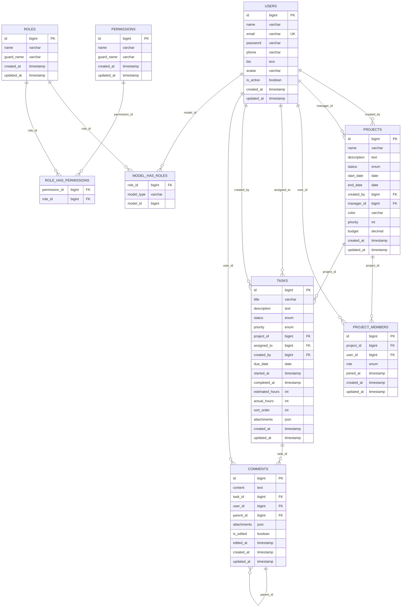
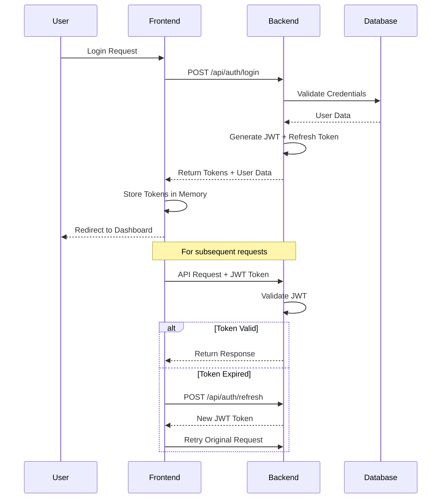
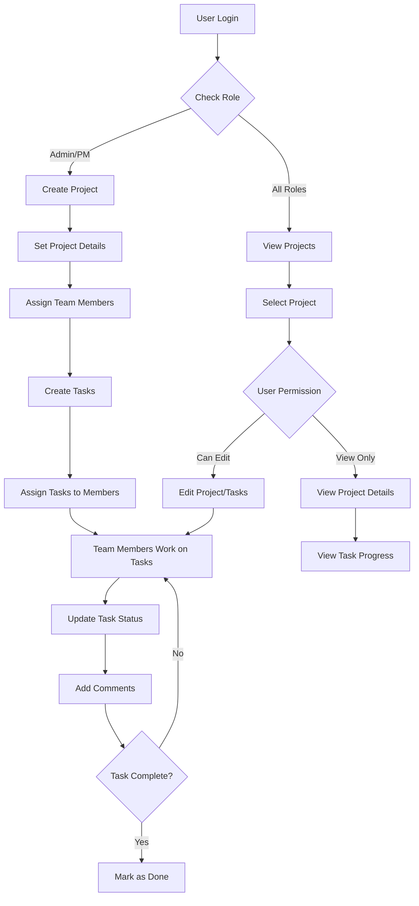
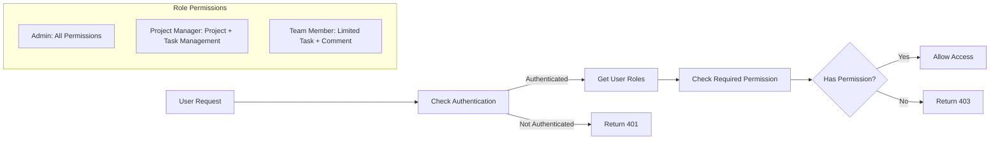

# Project Management System

Sebuah aplikasi manajemen tugas berbasis web yang memungkinkan tim untuk membuat proyek, menetapkan tugas, memantau progres, dan berkolaborasi. Sistem ini dilengkapi dengan autentikasi JWT dan frontend interaktif menggunakan TypeScript.

## 🚀 Fitur Utama

### Core Features

-   **Authentication JWT**: Login, registrasi, dan otorisasi user berbasis token JWT dengan refresh token
-   **Multi-Role Management**: Admin, Project Manager, dan Team Member dengan permission yang berbeda
-   **Project Management**: CRUD proyek dengan status tracking dan member management
-   **Task Management**: CRUD tugas dengan status (To Do, In Progress, Review, Done)
-   **Comment System**: Komentar nested pada tugas dengan file attachments
-   **Dashboard**: Statistik dan ringkasan proyek, tugas, dan progres
-   **Profile Management**: User dapat mengedit profil diri

### Premium Features

-   **Kanban Board**: Drag and drop task management
-   **File Attachments**: Upload file pada komentar dan task
-   **Chart Visualization**: Grafik progres proyek menggunakan Chart.js

## 🏗️ Teknologi yang Digunakan

### Backend

-   **Laravel 10+** - PHP Framework
-   **MySQL** - Database
-   **JWT Auth** - Authentication dengan refresh token
-   **Spatie Permission** - Role dan permission management
-   **Laravel Echo** - Real-time notifications (optional)

### Frontend

-   **React 18** - UI Library
-   **TypeScript** - Type-safe JavaScript
-   **Inertia.js** - SPA routing
-   **Tailwind CSS** - Styling framework
-   **Chart.js** - Data visualization
-   **DND Kit** - Drag and drop functionality

## 📊 Entity Relationship Diagram (ERD)



## 🔄 Alur Sistem

### 1. Authentication Flow



### 2. Project Management Flow



### 3. Permission System Flow



## 📋 Roles dan Permissions

| Permission     | Admin | Project Manager | Team Member |
| -------------- | ----- | --------------- | ----------- |
| Manage Users   | ✅    | ❌              | ❌          |
| Create Project | ✅    | ✅              | ❌          |
| Update Project | ✅    | ✅              | ❌          |
| Delete Project | ✅    | ❌              | ❌          |
| Assign Tasks   | ✅    | ✅              | ❌          |
| Update Tasks   | ✅    | ✅              | ✅\*        |
| Comment Tasks  | ✅    | ✅              | ✅          |
| View Dashboard | ✅    | ✅              | ✅          |

\*Team Member hanya bisa update task yang di-assign kepada mereka

## 🚀 Cara Deployment

### Prerequisites

-   PHP 8.1+
-   Composer
-   Node.js 18+
-   MySQL/PostgreSQL
-   Web server (Apache/Nginx)

### 1. Clone Repository

```bash
git clone https://github.com/ArvinKurniwan140/pms-apps.git
cd pms-apps
```

### 2. Install Dependencies

```bash
# Install PHP dependencies
composer install --optimize-autoloader --no-dev

# Install Node dependencies
npm install
```

### 3. Environment Setup

```bash
# Copy environment file
cp .env.example .env

# Generate application key
php artisan key:generate

# Generate JWT secret
php artisan jwt:secret
```

### 4. Configure Environment Variables

Edit `.env` file:

```env
APP_NAME="Project Management System"
APP_ENV=production
APP_DEBUG=false
APP_URL=https://yourdomain.com

DB_CONNECTION=mysql
DB_HOST=127.0.0.1
DB_PORT=3306
DB_DATABASE=pms
DB_USERNAME=root
DB_PASSWORD=

# JWT Configuration
JWT_SECRET=your_jwt_secret
JWT_TTL=60
JWT_REFRESH_TTL=20160

# Mail Configuration (for notifications)
MAIL_MAILER=smtp
MAIL_HOST=your_smtp_host
MAIL_PORT=587
MAIL_USERNAME=your_email
MAIL_PASSWORD=your_password
MAIL_ENCRYPTION=tls

# Pusher Configuration (for real-time notifications)
PUSHER_APP_ID=your_pusher_app_id
PUSHER_APP_KEY=your_pusher_key
PUSHER_APP_SECRET=your_pusher_secret
PUSHER_APP_CLUSTER=your_cluster
```

### 5. Database Setup

```bash
# Run migrations
php artisan migrate --force

# Seed initial data
php artisan db:seed --force

# Clear and cache config
php artisan config:cache
php artisan route:cache
php artisan view:cache
```

### 6. Build Frontend Assets

```bash
# Build production assets
npm run build
```

### 7. Set File Permissions

```bash
# Set proper permissions
sudo chown -R www-data:www-data storage bootstrap/cache
sudo chmod -R 775 storage bootstrap/cache
```

### 8. Web Server Configuration

#### Apache (.htaccess)

```apache
<IfModule mod_rewrite.c>
    RewriteEngine On
    RewriteRule ^(.*)$ public/$1 [L]
</IfModule>
```

#### Nginx

```nginx
server {
    listen 80;
    server_name yourdomain.com;
    root /path/to/your/project/public;

    add_header X-Frame-Options "SAMEORIGIN";
    add_header X-Content-Type-Options "nosniff";

    index index.php;

    charset utf-8;

    location / {
        try_files $uri $uri/ /index.php?$query_string;
    }

    location = /favicon.ico { access_log off; log_not_found off; }
    location = /robots.txt  { access_log off; log_not_found off; }

    error_page 404 /index.php;

    location ~ \.php$ {
        fastcgi_pass unix:/var/run/php/php8.1-fpm.sock;
        fastcgi_param SCRIPT_FILENAME $realpath_root$fastcgi_script_name;
        include fastcgi_params;
    }

    location ~ /\.(?!well-known).* {
        deny all;
    }
}
```

### 9. SSL Certificate (Recommended)

```bash
# Using Certbot for Let's Encrypt
sudo certbot --nginx -d yourdomain.com
```

### 10. Process Management (Optional)

```bash
# Install supervisor for queue workers
sudo apt install supervisor

# Create supervisor config
sudo nano /etc/supervisor/conf.d/laravel-worker.conf
```

Supervisor config:

```ini
[program:laravel-worker]
process_name=%(program_name)s_%(process_num)02d
command=php /path/to/your/project/artisan queue:work --sleep=3 --tries=3
autostart=true
autorestart=true
user=www-data
numprocs=2
redirect_stderr=true
stdout_logfile=/path/to/your/project/storage/logs/worker.log
```

## 🧪 Testing

### Default Test Users

After seeding, you can login with:

-   **Admin**

    -   Email: `admin@example.com`
    -   Password: `password`

-   **Project Manager**

    -   Email: `manager@example.com`
    -   Password: `password`

-   **Team Member**
    -   Email: `member1@example.com`
    -   Password: `password`

### API Testing

API endpoints tersedia di `/api/` dengan Bearer token authentication:

```bash
# Login
POST /api/auth/login

#Register
POST /api/auth/register

#me
GET /api/auth/me/Bearer Token

#refresh token
POST /api/auth/refresh/Bearer Token
```

## 🤝 Contributing

1. Fork repository
2. Create feature branch (`git checkout -b feature/AmazingFeature`)
3. Commit changes (`git commit -m 'Add some AmazingFeature'`)
4. Push to branch (`git push origin feature/AmazingFeature`)
5. Open Pull Request

## 📄 License

This project is licensed under the MIT License - see the [LICENSE](LICENSE) file for details.

## 🔄 Changelog

### v1.0.0 (Initial Release)

-   User authentication dengan JWT
-   Project dan task management
-   Comment system
-   Role-based permissions
-   Responsive dashboard

### v1.1.0 (Planned)

-   Kanban board functionality
-   File attachments
-   Advanced reporting

---

**Dibuat dengan ❤️ menggunakan Laravel & React TypeScript Oleh Kelompok Persib Juara**
**152023140 - Arvin Kurniawan**
**152023147 - Rizki Hidayatulloh**
**152023159 - Lutfi Perwira**
